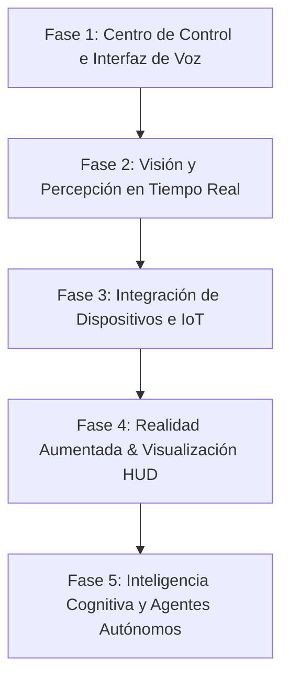

# Sophia: Asistente IA Avanzado (Jarvis-like)
## Ruta de Aprendizaje y Desarrollo (Roadmap)

Este documento detalla las fases para construir a **Sophia**, un asistente inteligente con capacidades conversacionales, visión computacional, conectividad IoT e interfaz de realidad aumentada.

---

## 🗺️ Fases del Proyecto

### 🔹 Fase 1: Centro de Control e Interfaz de Voz (Fase Actual 🚀)
**Objetivo**: Construir el núcleo visual y auditivo inicial de Sophia.
*   **Interfaz HUD Web**: Un panel con estética cyberpunk/glassmorphism, animaciones fluidas y un holograma reactivo.
*   **Conversación por Voz**: Integración de síntesis (TTS) y reconocimiento de voz (STT) utilizando las Web Speech APIs directamente en el navegador.
*   **Simulador de Respuestas**: Lógica inicial para procesar comandos locales simples.

### 🔹 Fase 2: Visión y Percepción en Tiempo Real
**Objetivo**: Permitir que Sophia "vea" lo que tú ves a través de cámaras.
*   **Acceso a Cámara Web**: Integración de flujo de video directo en la interfaz.
*   **Visión Computacional Local**: Uso de TensorFlow.js (por ejemplo, MobileNet o COCO-SSD) para detección de objetos, rostros y gestos directamente en el cliente.
*   **Modelos Multimodales**: Integración con APIs de visión (como Gemini 1.5/2.0 o GPT-4o) para análisis contextual profundo de imágenes o transmisiones de video.

### 🔹 Fase 3: Integración de Dispositivos e IoT
**Objetivo**: Convertir a Sophia en el cerebro de tu ecosistema tecnológico.
*   **Servidor Backend (Node.js/Python)**: Creación de un servidor local para interactuar con el sistema operativo y la red local.
*   **Control del PC**: Apagar, encender, abrir aplicaciones, controlar volumen, consultar uso de CPU/RAM.
*   **Protocolos IoT**: Integración con Home Assistant (o directamente a través de MQTT, Zigbee, o peticiones HTTP/REST) para controlar luces inteligentes, enchufes y otros electrodomésticos.

### 🔹 Fase 4: Realidad Aumentada (AR) y HUD en Vivo
**Objetivo**: Superponer los datos de Sophia directamente en tu visión.
*   **Modo AR WebXR/Three.js**: Creación de una experiencia web inmersiva en 3D que funcione en dispositivos móviles o gafas AR (como Meta Quest o Apple Vision Pro).
*   **Cámara HUD Móvil**: Interfaz de cámara móvil con superposiciones de datos de visión computacional en vivo (bounding boxes, lecturas de temperatura, etc.).

### 🔹 Fase 5: Inteligencia Cognitiva y Agentes Autónomos
**Objetivo**: Dotar a Sophia de memoria persistente, opiniones complejas y capacidad de ejecución autónoma de tareas.
*   **Memoria a Largo Plazo**: Base de datos vectorial (como ChromaDB o Pinecone) para almacenar el historial de interacciones y preferencias del usuario.
*   **Agente de Tareas**: Capacidad de buscar en internet, programar scripts, organizar archivos y resolver problemas complejos por sí misma.

---

## 🛠️ Stack Tecnológico Propuesto (Inicio)

*   **Frontend**: HTML5, Vanilla CSS3 (estética premium cyberpunk), JavaScript (ES6+).
*   **APIs Web**: Web Speech API (Reconocimiento y Síntesis de voz), WebRTC / MediaDevices (Cámara).
*   **Backend Opcional (Fases Siguientes)**: Node.js o Python con FastAPI.

---

## 🎯 Primer Paso: Centro de Control "Sophia Dashboard"
Comenzaremos creando una interfaz web premium con:
1. Un **holograma interactivo** que responde visualmente cuando Sophia habla o escucha.
2. Funcionalidad de **Reconocimiento de Voz** y **Respuesta Auditiva** en español.
3. Un panel de control simulado con estados de red, dispositivos conectados e información de visión de cámara.
